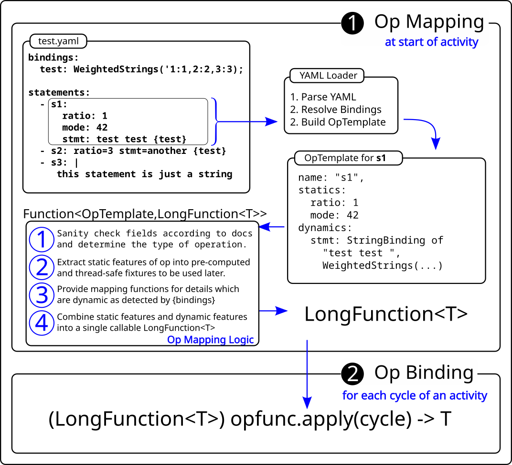

# OpTemplate API

The operation which will be executed in a driver should be derivable from
the YAML as provided by a user. Thankfully, NoSQLBench goes to great
lengths to make this easy for both to the user and to the driver
developer. In particular, NB presents the user with a set of formatting
options in the YAML which are highly flexible in terms of syntax and
structure. On the other side, it presents the driver developer with a
service interface which contains all the input from the user as a complete
data structure.

This means that the driver developer needs to make it clear how different
forms of content from the YAML will map into an operation. Fundamentally,
a driver is responsible for mapping the fully realized data structure of
an `op template` into an executable operation by NoSQLBench.

In some protocols or syntaxes, the phrase _the statement_ makes sense, as
it is the normative way to describe what an operation does. This is true,
for example, with CQL. In CQL You have a statement which provides a very
clear indication of what a user is expecting to happen. At a more abstract
level, and more correctly, the content that a user puts into the YAML is a
`statement template`, and more generally within NoSQLBench,
and `operation template`. This is simply called an `op template` going
forward, but as a driver developer, you should know that these are simply
different levels of detail around the same basic idea: an executable
operation derived from a templating format.

## Op Function Mapping

This is accomplished by using a technique called _Op Function Mapping_
-- the act of mapping an op template to an op function. There are two
functional steps in this process: First, at activity initialization, and
then later within each cycle.

This process is governed by a single type:

    Function<OpTemplate, LongFunction<T>>

In this type, the operation you will use is generic type T, and is up to
you, the driver developer. At activity initialization time, a function of
the type above will be used to construct a sequence of LongFunction<T>.
Within each cycle, one of these LongFunction<T> will be selected from the
sequence and called with the cycle to produce a fully realized operation.
This is the most challenging part of building a NoSQLBench driver, but it
is arguably the most important. This section is worth some study if you
want to understand one of the key mechanisms of NoSQLBench.

## Preparing Operations

During execution, NB needs to be fast and lean in terms of the prep work
needed to execute an operation. This means that, at startup, an activity
is responsible for doing two critical steps:

1) (Driver Logic) Map the YAML structure to a set of driver-specific
   operation templates.
2) (Core Logic, with Type specified by driver) Cache the operations in a
   ready form which is efficient to use.
3) (Core Logic) Assemble these ready operations into a sequence based on
   ratios.

Much of the boilerplate for doing this is handled already by the default
Activity implementation which is used by all drivers: the
_SimpleActivity_.

## Op Mapping

Step 1 above is all about mapping the YAML content for each statement to a
driver-specific type. For the sake of illustration, we'll call that simply
a ReadyOp. In order to provide this, you call
`super.createOpSequence(...)` with a function from _OpTemplate_ to your
ReadyOp type, and store the result in your activity.

As long as your function, say a _Function<OpTemplate,ReadyOp>_ knows what
the user means to do depending on what they put in the YAML structure,
steps #2 and #3 are already handled! You're done.

But wait, there's more. If you unpack the phrase above "what the user
means to do ...", you'll see that it is loaded with ambiguity. The rest of
this guide is meant to explain why and how you actually create that
all-important mapping function.

## Op Template Semantics

**NOTE:**
To fully understand this section, it is important that you understand what
the NB Standard YAML format looks like. A detailed explanation of this
format is found under the user guide, with detailed examples under the "
Designing Workloads", with each feature of the YAML format explained in
detail.

The actual type of mapping function provided by your driver will be up to
you, but it is not an actual operation to be executed. Each cycle will
synthesize the operation to be executed by combining your ready op type
above with a cycle number. Thus, from the yaml format to the operation,
there are two stages of resolution:

1. YAML to ready op, as controlled by your own Ready___Op implementation,
   as a Function<OpTemplate,YourTypeHere>.
2. ready op to operation, as controlled by the

### Reserved parameters

Some param names used in the YAML format are reserved for current or
future use by the NoSQLBench core. These are:

- name (used to name all elements within the Standard YAML format)
- ratio (used to set ratios in the Standard YAML format)
- type,driver,context,instance (future use)

These parameter names are sometimes visible as part of the OpTemplate, but
driver implementors are not allowed to reassign what they mean or how they
are used.

## Op Function Mapping

Op Function Mapping, or simply _Op Mapping_ is the process of interpreting
the op template and rendering a partially resolved operation back to
NoSQLBench.

Generally, Op Function Mapping is controlled by a driver-provided function
of type Function<OpTemplate,LongFunction<T>>. The result of calling this
function is another function which is used later during each cycle to
render a fully realized and executable operation.

The OpTemplate is a parsed and assembled view of everything the user has
specified for a statement in the yaml, including layering in values from
blocks and root document levels. This includes bindings, params, tags, and
so on. For bindings, it also knows which fields are specified as static
and which ones are tied to bindings with the
`{binding}` syntax.

This allows you, as the developer, to know which parts of an operation's
definition are intended to be fixed and which ones are to be deferred
until a specific cycle. The methods on the OpTemplate allow you to
interrogate the data.

Ideally, you would create an operation that is as fully resolved as
possible. Sometimes this is quite possible and sometimes it is not. For
example, if a user specifies that the type of operation is controlled by a
binding like `optype: {myoptype}` it is impossible to know what that type
will be until the cycle is being executed. Generally, you want to reject
this type of configuration as invalid, since this defeats the ability to
streamline the execution of ops with pre-configuration.

NoSQLBench configures an activity by calling your Op Function Mapping
function for each active instance of an op template as defined in the
YAML.

## Op Binding

Later, the runtime of NoSQLBench will use the result of your provided
function to render an executable operation, fully qualified with payload
details and any other dynamic features you allowed for in the op template
documentation for your driver. This is known as _binding an op template to
a cycle_, or simply _op binding_. There is nothing else for you do to
enable this. The function produced by your Op Template Mapping phase will
be used to power this within each cycle.

## Mapping and Binding Infographic

The infographic below provides an overview of the flow of information and
types throughout this process. The driver developer must provide an
implementation of an Op mapping function which is assignable to
a `Function<OpTemplate,LongFunction<T>>` as shown. The 4 steps in the _Op
Mapping Logic_ box describe a generalized approach that can be used for
each driver.

