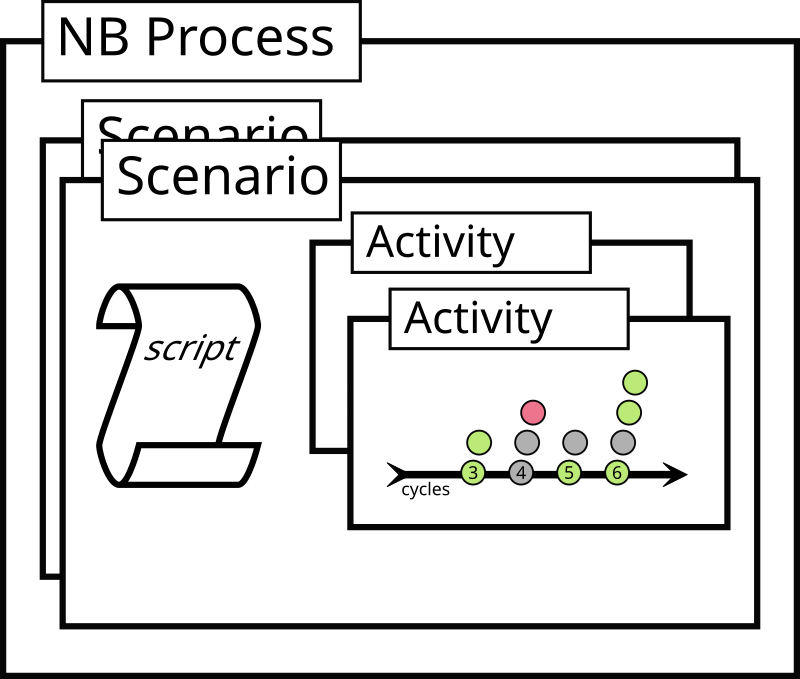

# Error Handling in NoSQLBench

This guide acts as a design template for how the error handling should be made consistent throughout
all of NoSQLBench and supported drivers.

## Scopes of Execution

### Process

A NoSQLBench process is active when you start a scenario from the command line, or when you start it
in docserver or some other daemon mode.

### Scenario
        
When a NoSqlBench process runs, it can execute scenario scripts in ECMAScript.
These are called scenarios. Each scenario runs independently of any others
in the current process.

Scenario scripts are completely unlimited in what they can do.
             
###  Activity

Scenario scripts may use the scripting API to start protocol specific activities which run over a
range of cycles. These activities run independently of each other within the scenario.

###  Cycle

Activities run like flywheels over a range of cycle values. Each cycle is responsible for initiating
a single operation with the help of a driver. In this context, _cycle_ means two things:

1. It is the specific value on the number line which is used as the seed value for all synthesized
   operations.
2. It is the logic which uses this cycle value to determine which operation to execute, what
   synthetic data to bind into it, and how to combine them together into a native operation for the
   target system.

###  Operation

Within a cycle, an operation will be submitted to a native driver or target system, and the result
will be scrutinized. It may be retried, and further operations based on the first one may be
injected additionally to run within the same cycle.

    Process
      Scenario
        Activity
          Cycle
            Operation

## Handling Errors

### Basic Errors

*BasicErrors* Are errors for which NoSQLBench knows the exact reason for it happening and can thus
inform the user with a direct error message and nothing else. Anywhere a specific type of error can
be caught which gives the user a direct understanding of what cause the error or how to correct it,
you should use a BasicError. All of the exception handling logic in NoSQLBench should recognize the
BasicError exception type and allow it to propoage unmodified to the top-most exception handler.
This allows consistent handling for these errors so that users don't get spammed with stack traces
and other distractions when they are not needed.

## Checked Exceptions

Checked exceptions are not followed dogmatically as a programming doctrine in NoSQLBench. The
reasons are more practical than philosophical, however. The gist is that littering contextual error
handlers all over the place for checked exceptions would over-complicate the layering of exception
handling rather than simplify it. Checked exceptions can force non-trivial code bases to have an
arbitrarily higher surface area when simpler modal exception handlers would suffice. Thus, if you
are having to deal with a checked exception and aren't sure how to handle it, it is generally OK to
wrap it in a RuntimeException and rethrow it. Some may disagree on this approach, and for those
developers, we are happy to take pull requests that make genuine improvements in this area.

## Error Handlers

Because NoSQLBench is a tool for testing things, it is important that the user have the ability to
customize the exception handling behavior according to testing criteria. This means both the ability
to say when to count certain outcomes as errors as well as the ability to retry for possibly
intermittent failures, and to communicate the status of errors clearly for consumption by other
users or systems.

The options that users are offered for handling errors with the CQL driver, for example are routable
by error type to any of:

1. stop
2. warn
3. retry
4. histogram
5. count
6. ignore

Where each error handler drops through all the rest once the error handling logic is invoked. The
user specifies at which level they want to handle specific types of errors and whether to consider
certain types of errors ad retryable or not.

Each driver needs to support this level of configuration. A simpler and more consistent API should
be built to make this easy for driver implementors.

Error handlers of this type are only expected at the operational level within a cycle. That is, the
error handling in the rest of the NoSQLBench machinery need not be so configurable. Thus, the error
handling semantics need to be dealt with on a driver-specific level.

## Scripting Errors
