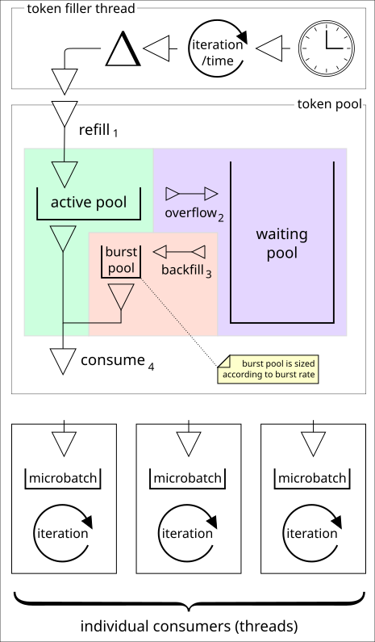

## RateLimiter Design

The nosqlbench rate limiter is a hybrid design, combining ideas from
well-known algorithms with a heavy dose of mechanical sympathy. The
resulting implementation provides the following:

1. A basic design that can be explained in one page (this page!)
2. High throughput, compared to other rate limiters tested.
3. Graceful degradation with increasing concurrency.
4. Clearly defined behavioral semantics.
5. Efficient burst capability, for tunable catch-up rates.
6. Efficient calculation of wait time.

## Parameters

**rate** - In simplest terms, users simply need to configure the *rate*.
For example, `rate=12000` specifies an op rate of 12000 ops/second.

**burst rate** - Additionally, users may specify a burst rate which can be
used to recover unused time when a client is able to go faster than the
strict limit. The burst rate is multiplied by the _op rate_ to arrive at
the maximum rate when wait time is available to recover. For
example, `rate=12000,1.1`
specifies that a client may operate at 12000 ops/s _when it is caught up_,
while allowing it to go at a rate of up to 13200 ops/s _when it is behind
schedule_.

## Design Principles

The core design of the rate limiter is based on
the [token bucket](https://en.wikipedia.org/wiki/Token_bucket) algorithm
as established in the telecom industry for rate metering. Additional
refinements have been added to allow for flexible and reliable use on
non-realtime systems.

The unit of scheduling used in this design is the token, corresponding
directly to a nanosecond of time. The scheduling time that is made
available to callers is stored in a pool of tokens which is set to a
configured size. The size of the token pool determines how many grants are
allowed to be dispatched before the next one is forced to wait for
available tokens.

At some regular frequency, a filler thread adds tokens (nanoseconds of
time to be distributed to waiting ops) to the pool. The callers which are
waiting for these tokens consume a number of tokens serially. If the pool
does not contain the requested number of tokens, then the caller is
blocked using basic synchronization primitives. When the pool is filled
any blocked callers are unblocked.

The hybrid rate limiter tracks and accumulates both the passage of system
time and the usage rate of this time as a measurement of progress. The
delta between these two reference points in time captures a very simple
and empirical value of imposed wait time.

That is, the time which was allocated but which was not used always
represents a slow down which is imposed by external factors. This
manifests as slower response when considering the target rate to be
equivalent to user load.

## Design Details

In fact, there are three pools. The _active_ pool, the _bursting_ pool,
and the
_waiting_ pool. The active pool has a limited size based on the number of
operations that are allowed to be granted concurrently.

The bursting pool is sized according to the relative burst rate and the
size of the active pool. For example, with an op rate of 1000 ops/s and a
burst rate of 1.1, the active pool can be sized to 1E9 nanos (one second
of nanos), and the burst pool can be sized to 1E8 (1/10 of that), thus
yielding a combined pool size of 1E9 + 1E8, or 1100000000 ns.

The waiting pool is where all extra tokens are held in reserve. It is
unlimited except by the size of a long value. The size of the waiting pool
is a direct measure of wait time in nanoseconds.

Within the pools, tokens (time) are neither created nor destroyed. They
are added by the filler based on the passage of time, and consumed by
callers when they become available. In between these operations, the net
sum of tokens is preserved. In short, when time deltas are observed in the
system clock, this time is accumulated into the available scheduling time
of the token pools. In this way, the token pool acts as a metered
dispenser of scheduling time to waiting (or not) consumers.

The filler thread adds tokens to the pool according to the system
real-time clock, at some estimated but unreliable interval. The frequency
of filling is set high enough to give a reliable perception of time
passing smoothly, but low enough to avoid wasting too much thread time in
calling overhead. (It is set to 1K/s by default). Each time filling
occurs, the real-time clock is check-pointed, and the time delta is fed
into the pool filling logic as explained below.

## Visual Explanation

The diagram below explains the moving parts of the hybrid rate limiter.
The arrows represent the flow of tokens (ns) as a form of scheduling
currency.

The top box shows an active token filler thread which polls the system
clock and accumulates new time into the token pool.

The bottom boxes represent concurrent readers of the token pool. These are
typically independent threads which do a blocking read for tokens once
they are ready to execute the rate-limited task.

In the middle, the passive component in this diagram is the token pool
itself. When the token filler adds tokens, it never blocks. However, the
token filler can cause any readers of the token pool to unblock so that
they can acquire newly available tokens.

When time is added to the token pool, the following steps are taken:

1) New tokens (based on measured time elapsed since the last fill) are
   added to the active pool until it is full.
2) Any extra tokens are added to the waiting pool.
3) If the waiting pool has any tokens, and there is room in the bursting
   pool, some tokens are moved from the waiting pool to the bursting pool
   according to how many will fit.

When a caller asks for a number of tokens, the combined total from the
active and burst pools is available to that caller. If the number of
tokens needed is not yet available, then the caller will block until
tokens are added.

## Bursting Logic

Tokens in the waiting pool represent time that has not been claimed by a
caller. Tokens accumulate in the waiting pool as a side-effect of
continuous filling outpacing continuous draining, thus creating a backlog
of operations.

The pool sizes determine both the maximum instantaneously available
operations as well as the rate at which unclaimed time can be back-filled
back into the active or burst pools.

### Normalizing for Jitter

Since it is not possible to schedule the filler thread to trigger on a
strict and reliable schedule (as in a real-time system), the method of
moving tokens from the waiting pool to the bursting pool must account for
differences in timing. Thus, tokens which are activated for bursting are
scaled according to the amount of time added in the last fill, relative to
the maximum active pool. This means that a full pool fill will allow a
full burst pool fill, presuming wait time is positive by that amount. It
also means that the same effect can be achieved by ten consecutive fills
of a tenth the time each. In effect, bursting is normalized to the passage
of time along with the burst rate, with a maximum cap imposed when
operations are unclaimed by callers.

## Mechanical Trade-offs

In this implementation, it is relatively easy to explain how accuracy and
performance trade-off. They are competing concerns. Consider these two
extremes of an isochronous configuration:

### Slow Isochronous

For example, the rate limiter could be configured for strict isochronous
behavior by setting the active pool size to *one* op of nanos and the
burst rate to 1.0, thus disabling bursting. If the op rate requested is 1
op/s, this configuration will work relatively well, although *any* caller
which doesn't show up (or isn't already waiting) when the tokens become
available will incur a waittime penalty. The odds of this are relatively
low for a high-velocity client.

### Fast Isochronous

However, if the op rate for this type of configuration is set to 1E8
operations per second, then the filler thread will be adding 100 ops worth
of time when there is only *one* op worth of active pool space. This is
due to the fact that filling can only occur at a maximal frequency which
has been set to 1K fills/s on average. That will create artificial wait
time, since the token consumers and producers would not have enough pool
space to hold the tokens needed during fill. It is not possible on most
systems to fill the pool at arbitrarily high fill frequencies. Thus, it is
important for users to understand the limits of the machinery when using
high rates. In most scenarios, these limits will not be onerous.

### Boundary Rules

Taking these effects into account, the default configuration makes some
reasonable trade-offs according to the rules below. These rules should
work well for most rates below 50M ops/s. The net effect of these rules is
to increase work bulking within the token pools as rates go higher.

Trying to go above 50M ops/s while also forcing isochronous behavior will
result in artificial wait-time. For this reason, the pool size itself is
not user-configurable at this time.

- The pool size will always be at least as big as two ops. This rule
  ensures that there is adequate buffer space for tokens when callers are
  accessing the token pools near the rate of the filler thread. If this
  were not ensured, then artificial wait time would be injected due to
  overflow error.
- The pool size will always be at least as big as 1E6 nanos, or 1/1000 of
  a second. This rule ensures that the filler thread has a reasonably
  attainable update frequency which will prevent underflow in the active
  or burst pools.
- The number of ops that can fit in the pool will determine how many ops
  can be dispatched between fills. For example, an op rate of 1E6 will
  mean that up to 1000 ops worth of tokens may be present between fills,
  and up to 1000 ops may be allowed to start at any time before the next
  fill.

  .1 ops/s : .2 seconds worth 1 ops/s : 2 seconds worth 100 ops/s : 2
  seconds worth

In practical terms, this means that rates slower than 1K ops/S will have
their strictness controlled by the burst rate in general, and rates faster
than 1K ops/S will automatically include some op bulking between fills.

## History

A CAS-oriented method which compensated for RTC calling overhead was used
previously. This method afforded very high performance, but it was
difficult to reason about.

This implementation replaces that previous version. Basic synchronization
primitives (implicit locking via synchronized methods) performed
surprisingly well -- well enough to discard the complexity of the previous
implementation.

Further, this version is much easier to study and reason about.

## New Challenges

While the current implementation works well for most basic cases, high CPU
contention has shown that it can become an artificial bottleneck. Based on
observations on higher end systems with many cores running many threads
and high target rates, it appears that the rate limiter becomes a resource
blocker or forces too much thread management.

Strategies for handling this should be considered:

1) Make callers able to pseudo-randomly (or not randomly) act as a token
   filler, such that active consumers can do some work stealing from the
   original token filler thread.
2) Analyze the timing and history of a high-contention scenario for
   weaknesses in the parameter adjustment rules above.
3) Add internal micro-batching at the consumer interface, such that
   contention cost is lower in general.
4) Partition the rate limiter into multiple slices.
