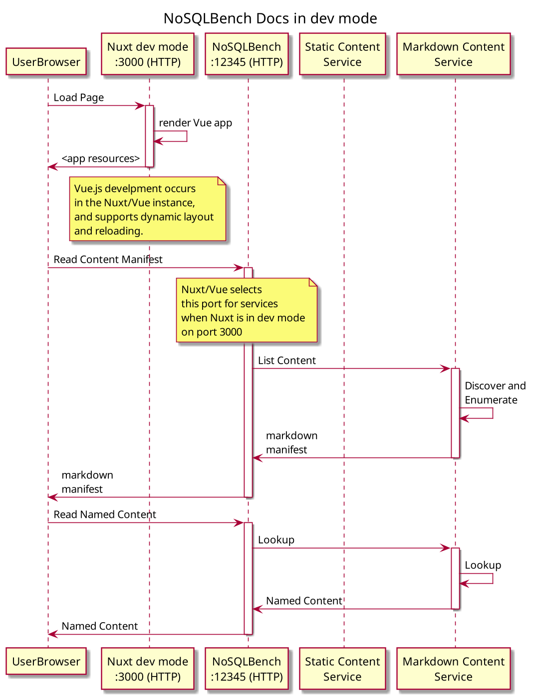
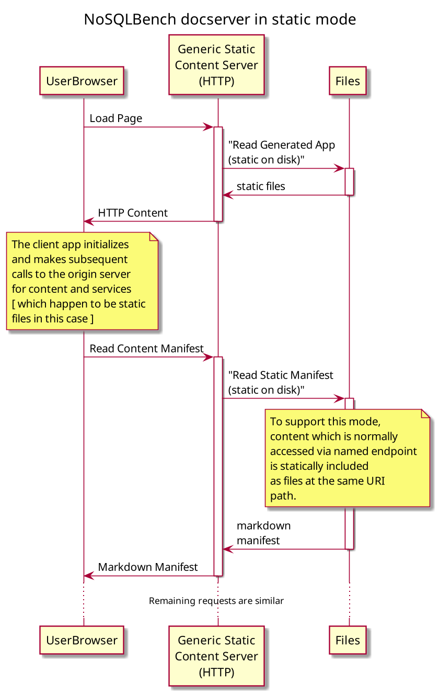

# NBUI

This is where the developer docs are kept for the NoSQLBench UI stack.

## Status

Presently (June/2020), NoSQLBench contains a web application and services layer, but it has not been
used for more than the documentation system. We are putting out request for comments and ideas and
for contributors who can build UIs in Vue.js around these ideas. This document is the first
consolidated view of how UIs work with NoSQLBench.

## NBUI Stack

The current _NBUI Stack_ consists of the NoSQLBench "nb" process, including the built-in web server,
The JAX-RS services which provide endpoints for accessing NoSQLBench functionality, and a set of
embedded web applications which are bundled within the nb application itself.

The docs for NoSQLBench are in-fact a Vue application. We use Nuxt as an framework/wrapper around
Vue to allow us to handle pre-rendering of the application for bundling. The docs application is
only an example of a Vue app in the NBUI stack, but it can be helpful for understanding how the
stack works.

The web apps are written in Vue.js as a separate developer workflow, but within the umbrella of the
NoSQLBench project. The documentation app lives in `src/main/node/docsys` under the docsys module.
It is a node and npm enabled Nuxt.js application. You can go to that directory and run it separately
under npm or yarn, which is what you would normally do when building any Vue/Nuxt application with
node js.

For bundling applications within the NoSQLBench distribution (jar or binary), Nuxt is used to
generate the "static site" form of the application. The result is packaged in
`src/main/resources/docsys-guidebook` and registered for sharing via the internal NoSQLBench static
content handler by way of the *DocsysDefaultAppPath* class, which is how all content sources are
found in NoSQLBench.

## NBUI Modes

Because the backing content for the docserver can come from a variety of sources, NBUI applications
can be run in different modes. Which mode you use depends on what you are doing, as explained below.

### Embedded Mode

This is the default mode that you get when you run `nosqlbench docserver`. In this mode, nosqlbench
starts up a Jetty container to serve content and JAX-RS services. One of the services is a static
content service which serves up the static copy of the generated UI application. This application is
static content on the server, but it includes a client-side application that further does dynamic
rendering and makes its own requests back to the server to fetch additional content or interact with
NoSQLBench service endpoints. This mode is illustrated by the following diagram:

### Development Mode

This is the mode that UI developers will care about the most. In this mode, UI developers can run
Vue apps in the usual dev mode while accessing endpoints in a running nosqlbench instance. To use
this mode, you start nosqlbench with the `nosqlbench docserver` command, and then separately run the
local Nuxt app with `npm dev` which is configured to run nuxt in dev mode.

This causes the services to wire together as illustrated in this diagram:

### Static Site Mode

This mode is used to host an NBUI app on a static site, where endpoint services are not available.
In this mode, content which would be returned from an endpoint path is statically exported into
files in the same path, such that a static content server with no dynamic page rendering can still
provide a snapshot of content to be used by the client-side applications.

The release pipeline creates this content with content export utilities, so that when new NoSQLBench
versions are released, the docs site is automatically updated with refresh of current content from
the source tree.

Client-side logic still runs (The client-side apps are always active), but the server simply hands
static content back from the file system:

## Interactive Or Not?

The three modes are useful and needed for different purposes:

- **Dev Mode** is needed for rapid development and prototyping of UIs and endpoint services. Dev
  mode is the only mode where you can make code changes and immediately refresh to see the results
  of your work. Dev mode supports full UI interactivity and endpoint services, so all application
  features can be developed.
- **Embedded Mode** is for users of NoSQLBench who need to actually use the built UIs. Like Dev
  mode, it supports full UI interactivity and endpoint services.
- **Static Mode** is for non-interactive use, and does not support endpoint service against an
  instance of NoSQLBench, since it is not served from a NoSQLBench process that can also provide
  these services.

Given that the static mode can't work with stateful services on a NoSQLBench server, a distinction
has to be made within an application about whether should support static mode. We'll put a
client-side check in where needed once we have other examples to work with. At the minimum, either
applications, or specific (interactive) application features will be disabled automatically if the
client-side application detects that endpoint services are not available. A future enhancement will
probably mean that the endpoint servers are fully configured and enabled by the client user as
needed.

### Developing with Nuxt

Using dev mode, you can build a vue.js application, configure it for being used as a _generated_ web
application, and then have it be hosted by NoSQLBench.

## Proposed Features

We propose these UI features to make using NoSQLBench easier:

### NBUI Wishlist

A user should be able to see all the NBUI apps from one place. They should be able to see the name
of each app, and some hover/title docs about what the app is used for. Users should be able to
switch to an app by clicking its name/menu entry. If a user has some unsaved work in one app that
they would lose by switching to another app, they should be prompted and given the choice to save or
discard their work first, or to cancel the action.

The NBUI Overview is not a highly functional app, but what it does is very important; It ties the
rest of the apps together within one cohesive view for the user. As such, it establishes a pattern
for the rest of the visual design of NBUI.

Sketch: A simple implementation of NBUI would be a frame holder with a menu of apps on the left. The
name of the current app could be the only app name showing by default. When the current app name is
clicked, it could unroll into a list of available app that the user could then pick between. Picking
another app would switch the currently active app within the overview frame and roll-up the app
names again to a single value. This basic design would leave a usable menu area below the app name
(and a subtle divider) so that the screen is still usable by each app, including the left. The left
panel could be toggled to be hidden, with a small corner visible to call it back.

### Scenario Runner

A user should be able to find all the named scenarios and select one to
run. They should be able to easily modify the parameters which the named scenario provides in
template variables. They should be able to run the configured scenario from the UI.

@phact (Sebastian) has already built one of these as a prototype. It would be a good starting point
for learning how web apps work in NoSQLBench. It will also need some updates to mesh well with
recent named scenarios features. This app needs to be tested and integrated into the main NBUI view.

Users should be able to run arbitrary commands in the scenario runner as well, just as they would on
the command line. This would allow them to use and test the rest of the UI features from a single
starting point.

### Scenario Status

An instance of a NoSQLBench process can run multiple scenarios, even concurrently. A user running
scenarios from NBUI will want to be able to see their overall status. This does not include metrics
status at this point, since the best view of this is largely provided already within the docker
metrics view.

Sketch: The scenario status app should list an info panel for each started or completed scenario. It
should contain the following details:

* The name of the scenario (All scenarios have a provided or auto-generated name)
* The commands which were used to start the scenario
* When it was started
* When it completed OR The current progress
* An ETA of completion

### VirtData Function Sandbox

A user should be able to find functions, chain them together, adjust their parameters within valid
ranges/values, and see example outputs over some input cycle range.

The preview of output values should be selectable between these types of visualizations:
- A histogram plot
- A list of values

Each output type is either numeric or non-numeric. In the degenerate case, numeric values should be
allowed to be converted to string form.

A user should be able to choose how they visualize the output: As either list of cycle to value
mappings, or a list of values, a summary of list values, or as a histogram. Additionally, numeric
output types should be plottable if possible.

### Workload Builder

Users should be able to build their workloads from the ground up. They should be able to take an
existing workload yaml as a starting point and tailor it as needed, and then save it.

This can take on the form of a syntax checking text editor, or as a node-based editor that allows
you to only add valid elements in the right place. In any case, the yaml form of the workload should
be accessible.

