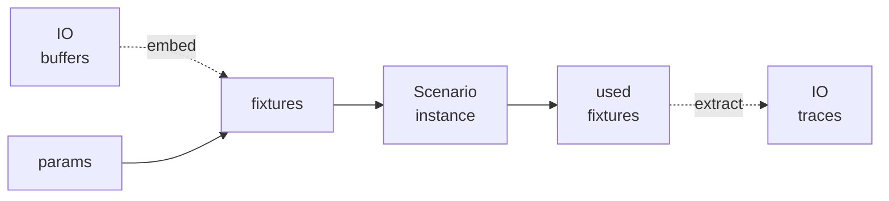

# Scenario Invocation

```mermaid
flowchart LR

    IO\nbuffers -. "embed" .-> fixtures
    params --> fixtures
    fixtures --> Scenario\ninstance
    Scenario\ninstance --> used\nfixtures
    used\nfixtures -. extract .-> IO\ntraces

```
