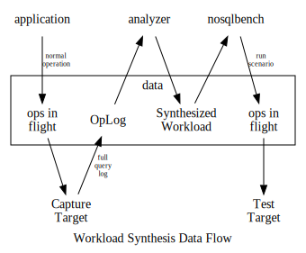

# Workload Synthesis

This document describes the background and essential details for understanding workload
synthesis as a potential NoSQLBench capability. Here, workload synthesis means constructing
a NoSQLBench workload based on op templates which is both representative of some recorded
or implied workload as informed by schema, recorded operations, or data set. The goal is
to construct a template-based workload description that aligns to application access patterns
as closely as the provided data sources allows.

With the release of Apache Cassandra 4.0 imminent, the full query log capability it provides
offers a starting point for advanced workload characterization. However, FQL is only a starting
point for serious testing at scale. The reasons for this can be discussed in detail elsewhere,
but the main reason is that the test apparatus has inertia due to the weight of the data logs
and the operational cost of piping bulk data around. Mechanical sympathy suggests a different
representation that will maintain headroom in testing apparatus, which directly translates to
simplicity in setup as well as accuracy in results.

Further, the capabilities needed to do workload synthesis are not unique to CQL. This is a general
type of approach that can be used for multiple drivers.

# Getting there from here

There are several operational scenarios and possibilities to consider. These can be thought of as incremental goals to getting full workload synthesis into nosqlbech:

1) Schema-driven Workload - Suppose a workload with no operations visibility

   This means taking an existing schema as the basis for some supposed set of operations. There are
   many possibilites to consider in terms of mapping schema to operations, but this plan only considers
   the most basic possible operations which can exercise a schema:
   
   - write data to a database given a schema - Construct insert operations using very basic and default
     value generation for the known row structure
   - read data to a database, given a schema - Construct read operations using very basic and default
     value generation for the known identifier structure
   
   Users should be allowed to specify which keyspaces and/or tables should be included.
   
   Users will be allowed to specify the relative cardinality of values used at each level of identifier,
   and the type of value nesting. 

   The source of the schema will be presumed to be a live system, with the workload generation being done
   on-the-fly, but with an option to save the workload description instead of running it. In the case of
   running the workload, the option to save it will be allowed additionally.

   The option to provide the schema as a local file (a database dump of describe keyspace, for example)
   should be provided as an enhancement.
   
   **PROS**
   
   This method can allow users to get started testing quickly on the data model that they've chosen
   with *nearly zero* effort.
   
   **CONS**
   
   This method only knows how to assume some valid operations from the user's provided schema. This means
   that the data model will be accurate, but it doesn't know how to construct data that is representative
   of the production data. It doesn't have the ability to emulate more sophisticated operational
   patterns or even inter-operational access patterns. it doesn't know how to construct inter-entity
   relationships.
   
   In essence, this is a bare-bones getting started method for users who just want
   to exercize a specific data model irrespective of other important factors. It should only be used
   for very basic testing or as a quick getting started workflow for more accurate workload definitions.
   As such, this is still a serious improvement to the user workflow for getting started.

2) Raw Replay - Replay raw operations with no schema visibility
   
   This is simply the ability to take a raw data file which includes operations and play it back via
   some protocol. This is a protocol-specific mechanism, since it requires integration with the
   driver level tools of a given protocol. As such it will only be avilable (to start) on a per-driver
   basis. For the purposes of this plan, assume this means "CQL".
   
   This level of workload generation may depend on the first "schema-driven workload" as in many cases,
   users must have access to DDL statements before running tests with DML statements. In some scenarios,
   this may not be required as the testing may be done in-situ against a system that is already populated.
   
   Further, it should be allowed that a user provide a local schema or point their test client at an existing
   system to gather the schema needed to replay from raw data in the absence of a schema.
   
   **PROS**

   This allows users to start sending operations to a target system that are facsimile copies of operations
   previously observed, with *some* effort.
   
   **CONS**
   
   Capturing logs and moving them around is an operational pain. This brings the challenge of managing
   big data directly into the workflow of testing at speed and scale.
   
   Specifically: Unless users can adapt the testing apparatus to scale better (in-situ) than the
   system under test, they will get invalid results. There is a basic principle at play here that
   requires a testing instrument to have more headroom than the thing being tested in order to avoid
   simply testing the test instrument itself. This is more difficult than users are generally prepared
   to deal with in practice, and navigating it successfully requires more diligence and investment
   than just accepting the tools as-is. This means that the results are often unreliable as the
   perceived cost of doing it "right" are too high. This doesn't have to be the case.

   The raw statement replay is not able to take advantage of optimizations that applications of
   scale depend on for efficiency, such as prepared statements.
   
   Raw statement replay may depend on native-API level access ot the source format. Particularly
   in the FQL form from Apache Cassandra 4.*, the native form depends on internal buffering formats
   which have no typed-ness or marshalling support for external consumers. Export formats can be
   provided, but the current built-in export format is textual and extremely inefficient for use
   by off-board tools.

   The amount of data captured is the amount of data available for replay.

   The data captured may not be representative across a whole system unless it is sampled across
   all clients and connections.
         
3) Workload Synthesis - Combine schema and operations visibility into a representative workload.

   This builds on the availability of schema details and operation logs to create a workload which
   is reasonably accurate to the workload that was observed in terms of data used in operations as
   well as relative frequency of operations. Incremental pattern analysis can be used to increase
   the level of awareness about obvious patterns as the toolkit evolves.

   The degree of realism in the emulated data set and operational patterns depends on a degree of deep analysis
   which will start out decidedly simple: relative rates of identifiable statement patterns, and simple
   statistical shaping of fields in operations.
   
   **PROS**
   
   This method allows users to achieve a highly representative workload that exactly reproduces the
   statement forms in their application, with a mix of operations which is representative, with
   a set of data which is representative, with *some* effort. Once this workload is synthesized,
   they can take that as much more accurate starting point for experimentation. Changes from this point
   are not dependent on big data, but on a simple recipe and description that can be changed
   in a text file and immediately use again with different test conditions.
   
   This method allows the test client to run at full speed, using the more efficient and extremely
   portable procedural data generation methods of current state-of-the-art testing methods in nb.
   
   This workload description also serves as a fingerprint of the shape of data in recorded operations.
   
   **CONS**
   
   This requires and additional step of analysis and workload characterization. For the raw data collection,
   the same challenges associated with raw replay apply. This can be caveated with the option that
   users may run the workload analsysi tool on system nodes where the data resides locally and then
   use the synthesized workload on the client with no need to move data around.
   
   As explained in the _Operations and Data_ section, this is an operation-centric approach to
   workload analysis. While only a minor caveat, this distinction may still be important with respect
   to dataset-centric approaches.

   **PRO & CON**
   
   The realism of the test depends directly on the quality of the analysis used to synthesize the
   workload, which will start with simple rules and then improve over time.

## Workflows

To break these down, we'll start with the full synthesis view using the following "toolchain" diagram:

In this view, the tools are on the top row, the data (in-flight and otherwise) in the middle,
and the target systems in the bottom. This diagram shows how the data flows between tools
and how is manipulated at each step.

## Operations and Data

Data in fields of operations and data within a dataset are related, but not in a way that allows a user to fully understand one through the lens of the other, except in special cases.

This section contrasts different levels of connectedness, in simple terms, between operations
and data that result from them.

First lest start with an "affine" example. Assume you have a data set which was build from additive operations such as (pseudo-code)

    for all I in 0..1000
     for all names in A B C D E
      insert row (I, name), values ...

This is an incremental process wherein the data of the iterators will map exactly to the
data in the dataset. Now take an example like this:

    for all I in 0..1000
     for all names in A B C D E
      insert row ((I mod 37), name), values ...

In this case all we've done is reduce the cardinality of the effective row identifier. Yet, the operations are not limited to 37 unique operations. As a mathematician, you could still work out
the resulting data set. As a DBA, you would never want to be required to do so.

Let's take it to the next level.

    for all I in 0..1000
     for all names in A B C D E
      insert row ((now() mod 37), name), values...
     
In this case, we've introduced a form of indeterminacy which seems to make it impossible to predict
the resulting state of the dataset. This is actually much more trivial than what happens in practice
as soon as you start using UUIDs, for example.

Attempts have been made to restore the simplicity of using sequences as identifiers in distributed systems, yet no current implementation seems to have a solid solution without self-defeating
trade-offs in other places. Thus, we have to accept that the relationship between operations and dataset is _complicated_ in practice. This is merely one example of how this relationship gets weakened in practice.

The point of explaining this at this fundamental level of detail is make it clear that we need to treat data of operations an datasets as independent types of data.

To be precise, the data used within operations will be called **op data**.  In contrast, the term **dataset** will be taken to mean data as it resides within storage, distinct
from op data.

 
 
 
 