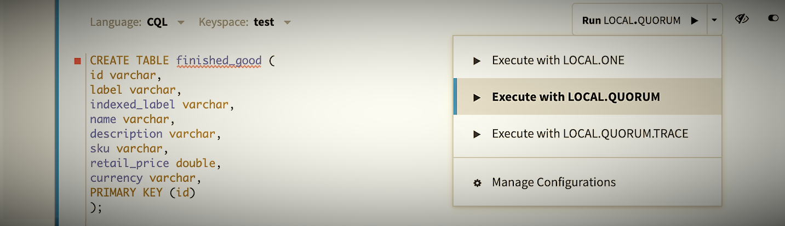

# CQL-Starter

<p>Author: Jeff Banks (DataStax)</p>
<p>&nbsp;</p>

## Introduction

Welcome to the NoSQLBench Quick Byte, the first session in a “Getting Started” series for 
NoSQLBench. This session introduces a new Cassandra Query Language (CQL) starter workload now 
available in version 5 of NoSQLBench.

* If you haven't heard of NoSQLBench, checkout our [introduction material](../../introduction/_index.md)
* If you already have a foundation with NoSQLBench and would like to understand what's included 
  in the most recent version, checkout the [release notes](https://github.com/nosqlbench/nosqlbench/releases/latest).

This session illustrates use of CQL, using NoSQLBench v5, along with a Docker deployment of 
 Apache Cassandra 4.1 using its latest image.

Let’s get rolling …

## Setup

This session was tested with:

* Ubuntu (v20.4)
* Docker (v20.10.18)
* NoSQLBench (v5.17.2)
* Apache Cassandra (v4.1)


#### Install Docker

Ensure Docker is installed on your operating system. You can download it from
[here](https://www.docker.com/)

#### Get NB5

Obtain official NB5 release, if you don't already have it, from
[latest nb5 release](https://github.com/nosqlbench/nosqlbench/releases/latest),
and then `chmod +x nb5`.

See [get nosqlbench](../../getting-started/00-get-nosqlbench.md) for other download options.

You should be able to see your version installed using:

```
./nb5 --version
```

#### Run Cassandra

Run the latest Cassandra 4.* docker.

```
docker run --name cass4 -p 9042:9042 -d cassandra
```

If you have issues, more details can be found at
[Apache Cassandra on docker hub](https://hub.docker.com/_/cassandra).


Verify Cassandra is started from logs:

```
docker container logs cass4
```

# Running the scenario

Now, we are ready to run the cql-starter NoSQLBench scenario.

#### Locate NB5 
Navigate via your local command line to where the nb5 binary was previously downloaded.

#### Verify 
Ensure that issuing the following command identifies the workload used for this session.

```
./nb5 --list-workloads | grep cql-starter
```

Example output:

``` 
/activities/baselines/cql-starter.yaml
```

#### Optional step
An alternative is to copy the workload configuration listed below to your own local file in a 
folder of your choosing. You can name it whatever you like, as you will specify the absolute 
file path directly when issuing the scenario command.

## CQL workload template

This YAML file is designed as a basic foundation for continuing to learn NoSQLBench 
capabilities as well as a starting point for customizing for your own testing needs.

You will notice that the number of cycles are minimal to support local testing to ensure that 
your configuration is constructed properly.  When customizing these for real-world tests, the 
values can be set to millions or more!  That is where the full power of NoSQLBench shines to 
generate critical metrics for analysis to make a system more robust.

```yaml

description: >2
 A cql-starter workload.
 * Cassandra: 3.x, 4.x.
 * DataStax Enterprise: 6.8.x.
 * DataStax Astra.

scenarios:
 default:
   schema: run driver=cql tags==block:schema threads==1 cycles==UNDEF
   rampup: run driver=cql tags==block:rampup cycles===TEMPLATE(rampup-cycles,1) threads=auto
   main: run driver=cql tags==block:"main.*" cycles===TEMPLATE(main-cycles,10) threads=auto
   # rampdown: run driver=cql tags==block:rampdown threads==1 cycles==UNDEF
 astra:
   schema: run driver=cql tags==block:schema-astra threads==1 cycles==UNDEF
   rampup: run driver=cql tags==block:rampup cycles===TEMPLATE(rampup-cycles,10) threads=auto
   main: run driver=cql tags==block:"main.*" cycles===TEMPLATE(main-cycles,10) threads=auto

params:
 a_param: "value"

bindings:
 machine_id: ElapsedNanoTime(); ToHashedUUID() -> java.util.UUID
 message: Discard(); TextOfFile('data/cql-starter-message.txt');
 rampup_message: ToString();
 time: ElapsedNanoTime(); Mul(1000); ToJavaInstant();
 ts: ElapsedNanoTime(); Mul(1000);

blocks: 
 schema:
   params:
     prepared: false
   ops:
     create-keyspace: |
       create keyspace if not exists <<keyspace:starter>>
       WITH replication = {'class': 'SimpleStrategy', 'replication_factor': '<<rf:1>>'}
       AND durable_writes = true;
     create-table: |
       create table if not exists <<keyspace:starter>>.<<table:cqlstarter>> (
       machine_id UUID, 
       message text,   
       time timestamp,         
       PRIMARY KEY ((machine_id), time)
       ) WITH CLUSTERING ORDER BY (time DESC);

 schema-astra:
   params:
     prepared: false
   ops:
     create-table-astra: |
       create table if not exists <<keyspace:starter>>.<<table:cqlstarter>> (
       machine_id UUID,
       message text,
       time timestamp,
       PRIMARY KEY ((machine_id), time)
       ) WITH CLUSTERING ORDER BY (time DESC);

 rampup:
   params:
     cl: <<write_cl:LOCAL_QUORUM>>
     idempotent: true
   ops:
     insert-rampup: |
       insert into  <<keyspace:starter>>.<<table:cqlstarter>> (machine_id, message, time)
       values ({machine_id}, {rampup_message}, {time}) using timestamp {ts};

 rampdown:
   ops:
     truncate-table: |
       truncate table <<keyspace:starter>>.<<table:cqlstarter>>;

 main-read:
   params:
     ratio: <<read_ratio:1>>
     cl: <<read_cl:LOCAL_QUORUM>>
   ops:
     select-read: |
       select * from <<keyspace:starter>>.<<table:cqlstarter>>
       where machine_id={machine_id};
 main-write:
   params:
     ratio: <<write_ratio:9>>
     cl: <<write_cl:LOCAL_QUORUM>>
     idempotent: true
   ops:
     insert-main: |
       insert into <<keyspace:starter>>.<<table:cqlstarter>>
       (machine_id, message, time) values ({machine_id}, {message}, {time}) using timestamp {ts};
```


Before running NoSQLBench scenario, let’s take a look at the layout of the file.  Most of this 
will be the same layout structure used in all NB5 workload files so this helps to reveal a 
large amount of the basics. This is called a _workload template_.

Starting from the top of the workload template, the primary sections include:

* Description - A way to describe what the workload does.
* Scenarios - A set of named scenarios for detailing the intent of the workload and defines that for various blocks (e.g. schema, rampup, main, etc.).
* Params - Optional parameters of interest to reference for applying values.
* Bindings - Named recipes for generated data.  These are referenced in block operations.
* Blocks - Where the labeled operations reside (e.g. schema, rampup, and main).
  * Schema - A block section where the schema is actually defined and created.
  * Rampup - A block section for data setup that becomes the backdrop for testing; it’s the density of data outside the metrics collected in the main block.
  * Main - A block section that is the target of metrics collection activities.

This may look overwhelming at first glance, but the magic of what can be done for load testing target resources becomes more apparent as settings are tweaked for various test cases.

### Basic Operations

The workload operations in the cql-starter are quite basic, and this is on purpose.  The intent 
is to focus on a simple set of read and write operations to understand how to work with 
NoSQLBench and Cassandra using basic, direct CQL.

### Table and Keyspace

For the default scenario workload, a simple table named ‘cqlstarter’ will be created with a keyspace 
 named ‘starter’.  There will be three fields for our table:

  * machine_id
  * message
  * time

The machine_id is a unique identifier type, the message field is a text type, and the time is a 
 timestamp type.

Since the example is designed to be run locally, the Cassandra keyspace replication is defined 
 using a SimpleStrategy with a replication factor of one.

```
WITH replication = {'class': 'SimpleStrategy', 'replication_factor': '<<rf:1>>'}
```

### Default scenario

For this session, the ‘default’ scenario is being used.

```yaml
    
    scenarios:
      default:
        schema: run driver=cql tags==block:schema …
        rampup: run driver=cql tags==block:rampup …
        main: run driver=cql tags==block:"main.*" …
```


One may notice there is an ‘astra’ scenario included in the file with its own set of activities 
defined (e.g. `-astra`).  References to `astra` are simply there to show how additional 
scenarios can be defined in a single workload file.


```yaml
    
    astra:
      schema: run driver=cql tags==block:schema-astra threads==1 cycles==UNDEF      
```

This illustrates how flexible and customizable the workload file can become.  The words are 
 customizable and can be tailored for understanding the test case for any business or technical domain.

### Bindings

Values for our three fields during insert, will come from the bindings section of the file.  
Basic examples are included in the cql-starter, but this illustrates how bindings supply 
values to be used by operations.  Again, these are basic, just to illustrate how binding 
functions can be utilized.

```yaml

    
    bindings:
      machine_id: ElapsedNanoTime(); ToHashedUUID() -> java.util.UUID
      message: Discard(); TextOfFile('data/cql-starter-message.txt');
      rampup_message: ToString();
      time: ElapsedNanoTime(); Mul(1000); ToJavaInstant();
      ts: ElapsedNanoTime(); Mul(1000);
```

Notice how we can reference text from a file to be used for our message value.  Nothing fancy, 
but illustrates how tests can leverage external information from files for decoupling input 
from the workload file itself.  Think of this for things like secret token references, etc. 
that need to be referenced.

```
Discard(); TextOfFile('data/cql-starter-message.txt')
```

Note: The Discard() function is used to indicate a no-op as the initial message value.  This 
may change in the future, but for now it is a necessity due to the nature of bindings 
defaulting to Long values.  This is why the `rampup_message` was included for illustration as it uses a
`ToString();` function assigning a string value.  By default, the binding's value is 0L.

## Hands on

Let’s run the cql-starter.

#### Running

Using the nb5 binary, issue the following command

```
./nb5 activities/baselines/cql-starter.yaml default hosts=localhost localdc=datacenter1
```
 
This command identifies that the default scenario workload is used with the key-value args passed along 
for use by the cqld4 adapter.

#### Examine the results
After the workload has been run, let’s take a look at the results from Cassandra itself using cqlsh.

```
docker container exec -it cass4 sh
cqlsh
select * from starter.cqlstarter;
```

You should see the single rampup entry along main operation entries in the Cassandra table.


#### Customize

Now, let’s customize the cql-starter to make it a bit more your own.

#### Save the .yaml file to your local environment.
One easy way, is to utilize the nb5 --copy command.
```
./nb5 --copy cql-starter
```
This provides a fresh workload file for you for cql-starter.


Edit the file and uncomment under the default scenario the following entry:

```
# rampdown: run driver=cql tags==block:rampdown threads==1 cycles==UNDEF
```

When you want to customize the cql-starter, you can simply target the file outside the 
 NB5 distribution using:

```
./nb5 adapter-cqld4/<rel-path-to-customized-file>.yaml default hosts=localhost localdc=datacenter1
```

Also, if you would like to see more details in the output, add (-v, -vv, or -vvv) to the command.

```
./nb5 adapter-cqld4/<rel-path-to-customized-file>.yaml default hosts=localhost localdc=datacenter1 -v
```

When the workload is run after uncommenting the rampdown, selecting the content again using 
 cqlsh, returns a table that has been truncated.

## Next Steps

Checkout the NoSQLBench [getting started](../../getting-started/_index.md) section and details for its 
capabilities for your next testing initiative. This includes a number of 
[built-in workloads](../../getting-started/02-scenarios.md) that you can start from for more 
advanced scenarios.

# Want to contribute?

It’s worth mentioning, NoSQLBench is open source and we are looking for contributions to expand 
its features!  Head on over to the [contributions](https://docs.nosqlbench.io/contributing) 
page to find out more.

We will continue to have more Quick Bytes for NoSQLBench in the near future.

Stay tuned, and thank you for reading!
