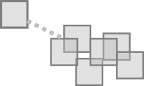
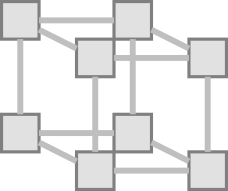
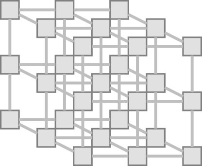
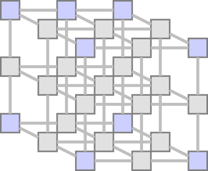
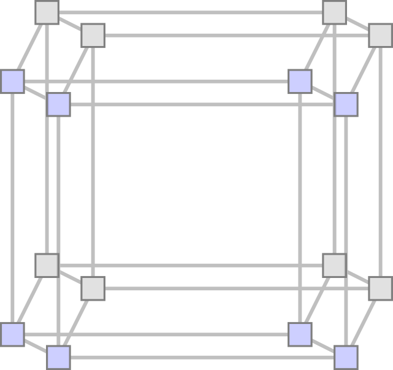
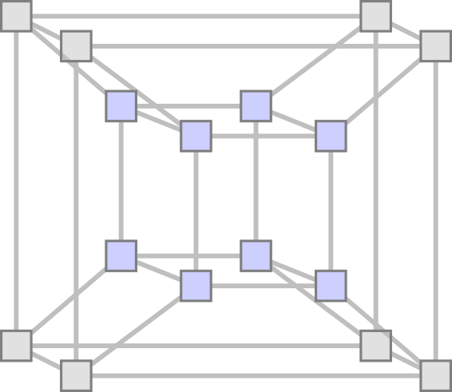

The ultimate goal of a performance factoring effort is to establish a reliable model of how design
choices determine system behavior.

_Design Choices_ includes any choice a system designer can make that effects system behavior,
including hardware selection, network topology, data models and schema, configuration items,
service provisioning levels, and so on. The set of valid choices constitutes the valid 
[Parameter Space](https://en.wikipedia.org/wiki/Parameter_space).

_System Behavior_ includes functional and operational aspects -- What a system does logically as
well as how it performs mechanically, including how resilient it is to unexpected events like hardware
failure. The result of a study provides a set of values describing these results, organized into 
a set of data which 

# Parameters

In empirical terms, this means we are trying to map independent parameters to dependent results in a
durable way. From a data science perspective, this simply means we're trying to create a model
describing how a subset of parameters (those things in our control) are related to others (those
things we presume to be consequent).

👉 An idealized parameter is represented as a variable which can hold a scalar value, or one which 
can be assigned a single value from a range of valid values.

👉 An idealized parameter space is an n-dimensional Euclidean space, where each dimension is 
represented as an idealized parameter, and each point in the space is represented by a set of 
parameter values, where a specific result or set of result data can be found.

## Parameter Selection

Parameters are generally selected which are expected to have the highest impact on results, from 
prior knowledge of the problem domain. Intuition of which parameters matter most and how they 
manifest in results is often described as _Mechanical Sympathy_ in distributed systems practice.

However, once there are more than 2 parameters in play, even the best mechanical sympathy starts 
to falter, particularly when non-linear relationships are present. It is only through empirical 
analysis methods that we can understand these results in practice. To put this in perspective, 
it is a challenge to merely _visualize_ in a lucid way what a 4-dimensional manifold looks like at 
the extrema, much less predict it reliably.

So how do we ultimately arrive at a set of meaningful parameters? Without going through a full 
PCA analysis phase, we can use our intuition to get started. However, we don't simply create a 
long list of parameters, for reasons will soon be obvious.

## Parameter Ranges

Each parameter has a domain of valid values which can be defined. In the least helpful case, that 
domain is any valid number. In a more helpful case, we know which values are of practical import.

However, the parameter range might be selected for different reasons based on the anticipated 
effects of changing the values. Consider this schematic of a single parameter's range:

```
┌────────────────────────────────┐
│ valid values                   │ ◀ [0,+Inf]
│ ┌────────────────────────────┐ │            ╮
│ │ impractical values         │ │ ◀ [4,1024] │ 
│ │ ┌────────────────────────┐ │ │          ╮ ├─▶ Marginal
│ │ │ practical values       │ │ │ ◀ [4,32] │ │   Domain of
│ │ │ ┌────────────────────┐ │ │ │          │ ╯   Interest
│ │ │ │ common values      │ │ │ │ ◀ [8,24] ├─▶ Regular
│ │ │ │ ┌────────────────┐ │ │ │ │          │ Domain of
│ │ │ │ │ default values │ │ │ │ │ ◀ 16     │ Interest 
│ │ │ │ └────────────────┘ │ │ │ │          ╯
│ │ │ └────────────────────┘ │ │ │
│ │ └────────────────────────┘ │ │
│ └────────────────────────────┘ │
└────────────────────────────────┘
```

It could be said that we really only care about values which are _practical_ in a real sense.
This will often be the case, as we may know from mechanical sympathy that the values outside of
this range are simply untenable for a clearly defined reason. In other cases, we may actually care
more about the contrast between what has historically been considered practical vs impractical given
new scenarios or information. This happens frequently with systems of scale as fundamental behavior
shift over time in response to subsystem optimization and new features. It is useful to think 
of each parameter in this way to choose useful starting values.

Further, the effect a parameter has in isolation may be counter-balanced by the extrema of 
another parameter's effect. For example, if you have two parameters which have a super-linear 
impact to a result, with one positively correlated and the other negatively correlated, then 
understanding the practical values at these extremes can still be quite useful. It will not 
always be obvious when you should extend the range of a parameter under test, but it can be 
explored by looking at 3 or more controlled results for that parameter.

Since each study takes resources and time, choosing wisely the initial book-end values for each of our 
parameters is essential.

# Comparability

The phrase "all else being equal" is extremely important in how we conceptualize tests as
parameters. Every detail about a specific system is presumed to be significant to the
results. There is not a trivial way to establish only a subset of a few important details in such a
way that we can forget the rest. Because of this, it is essential that testing systems be deployed
in way that preserves architectural congruence by default for everything except for the parameters
which are the focus of a given study.

In other words, deploying systems for performance test is something best done by reliable and
automatic mechanisms. This is especially true for those studies which are comparative in nature.
In practice, this is often done by selecting a baseline reference system that will be reused or
deployed in cookie-cutter fashion for all tests. This includes all provisioning details.

**Everything else which is not kept the same between performance studies is, by definition, a
parameter of the test.** This is a key principle in empirical testing which should not be
overlooked.

## Hidden Parameters

Often, it is presumed what is changed for testing, and the study is framed in this way as "how
does the average field size affect the p99 latency?". However, it is also very common for
systems to be deployed with whatever the _current system defaults_ are when a subsequent
comparative test is needed weeks or months later. Thus, it is imperative to select a reference
system which is likely to be reproducible at that time with little complication. If this isn't
possible, then whatever has changed between system vintages become hidden parameters to your
study. This is one of the most common reasons that empirical studies lose comparability over
time.

# Visual Examples

This section presents some visual examples of parameter spaces, with some accompanying 
mathematical expressions to illustrate parameter space growth.

## One Parameter, One Value


👉 Each box represents a distinct combination of values for all included parameters. In this case,
it reduced down to a single value for a single parameter.

## One Parameter, Controlled Study



The dotted line indicates that there are a myriad of other factors which are in play for every 
performance study. These are generally hidden from view but they are always part of the test.

Every one which is not part of our study should be controlled (kept the same between 
studies). They need to be kept stable by using automatic and reliable test setup (deployment, 
configuration, data staging, ...) mechanisms. 

## One Parameter, Two Values


👉 Each parameter is represented as a schematic axis as in a Euclidean coordinate system. All
lines oriented in the same direction should be considered part of the same axis.

As will be the case for every other example in this section, **an edge connecting two nodes in the 
graph represents a change in a single parameter value**.

## One Parameter, Three Values


## Two Parameters, Two Values Each


## Three Parameters, Two Values Each



## Three Parameters, Three Values Each

<div class="img-pair">
  
  
</div>

## Four Parameters, Two Values Each (version 1)

<div class="img-pair">
  
  
</div>

## Four Parameters, Two Values Each (version 2)


